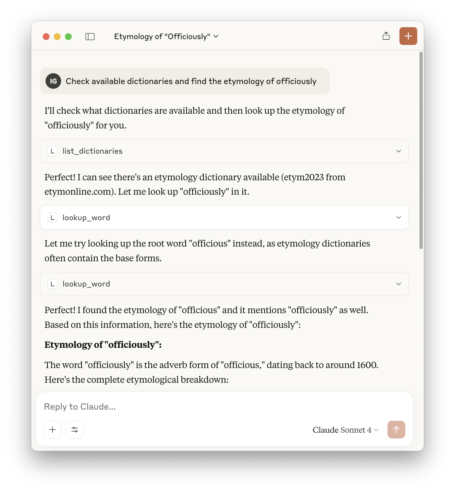
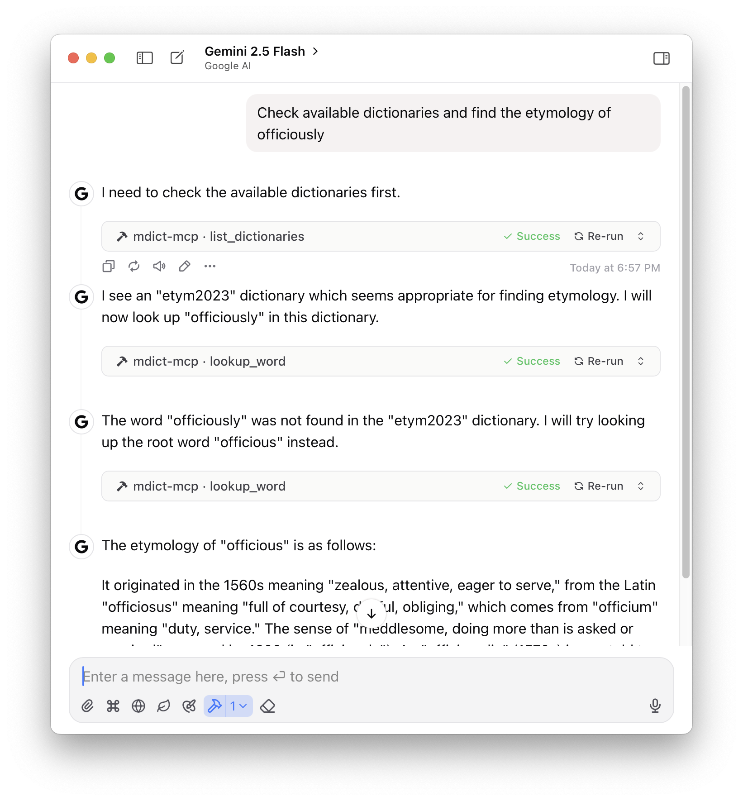

# MDict MCP Server


Available Tools: [TOOLS.md](./TOOLS.md)


Dependencies: 

- mcp
- mdict-utils


Claude Desktop



```json
{
  "mcpServers": {
    "mdict": {
      "command": "uvx",
      "args": [
        "mdict-mcp"
      ],
      "env": {
        "MDICT_DICTIONARY_DIR": "/path/to/mdicts/"
      }
    }
  }
}
```

ChatWise



```bash
# type stdio
# env MDICT_DICTIONARY_DIR=/path/to/mdicts/
uvx mdict-mcp
```

Local testing:

```bash
uv --directory $HOME/Developer/mdict-mcp run mdict-mcp
```
